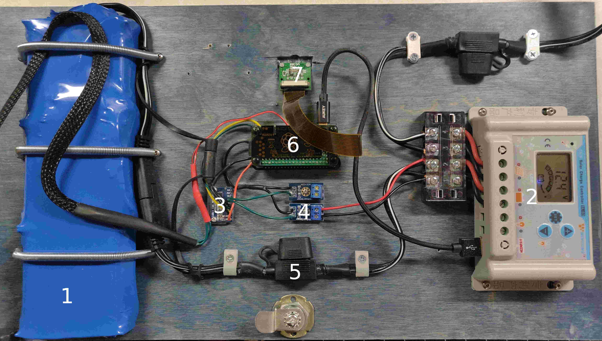

# Little Free Library Monitor

This is a Python Flask project I'm creating to monitor activity in my [Little Free Library](https://littlefreelibrary.org/) using a solar powered Raspberry Pi Zero.

Little Free Library is a trademark of the non-profit [Little Free Library](https://littlefreelibrary.org/) and is used under permission of being a steward.

## Features
- Door trigger for light and camera controls
- Image gallery
- Update script for automatic pulls from Git
- Graph voltage history for battery and panel
  - Uses [Highcharts](https://www.highcharts.com) under the CC Attribution-NonCommercial 3.0 licenses.  Please see Highcharts website to license for commercial use.

## Technologies:
- Flask
- GPIO
- PICamera
- Blinkt
- Bootstrap v4

## Solor Configuration
{:height="50%" width="50%"}
1. Battery Pack
   1. This is a 4P3S pack of 18650 batteries with 11.1v nominal and 12.6v peak.
   2. [Samsung 18650 30Q 3000mAh](https://www.ebay.com/itm/Lot-Samsung-18650-30Q-3000mAh-High-Drain-Rechargeable-Vape-Battery-with-Case/253825057433?ssPageName=STRK%3AMEBIDX%3AIT&_trksid=p2057872.m2749.l2649)
      1. These batteries have enough power to run everything for about a week, but (to be fair to the batteries) that week had highs of about -10F.  They hardly got any charge due to it being either snowing or overcast.
   3. [Battery holder](https://www.amazon.com/gp/product/B071XTGBH6/ref=ppx_yo_dt_b_asin_title_o08_s00?ie=UTF8&psc=1)
      1. This battery holder worked well by breaking the insulation along a solid piece of stranded wire, putting the tab through the middle of the wire, and soldering it in place.
   4. [Heat Shrink tubing](https://www.amazon.com/gp/product/B07DYWS1HK/ref=ppx_yo_dt_b_asin_title_o09_s00?ie=UTF8&psc=1)
2. [PowMR 20A Solar Controller](https://www.amazon.com/gp/product/B07H86V67R/ref=ppx_yo_dt_b_asin_title_o03_s00?ie=UTF8&psc=1)
   1. This is a cheap PWM controller that has enough battery settings to safely charge Lithium Ion batteries, but not necessarily very optimally.
   2. 
3. [ADS1115 Analog to digital converter](https://www.amazon.com/gp/product/B01DLHKMO2/ref=ppx_yo_dt_b_asin_title_o02_s00?ie=UTF8&psc=1)
4. [0-25v voltage reducer](https://www.amazon.com/gp/product/B07G5ZSCXH/ref=ppx_yo_dt_b_asin_title_o05_s00?ie=UTF8&psc=1)
5. [Fused cable](https://www.amazon.com/gp/product/B07JGDQBJX/ref=ppx_yo_dt_b_asin_title_o04_s00?ie=UTF8&psc=1)
   1. I replaced the included fuses with 5A fuses, as there should never be that much current
6. Raspberry Pi Stack
   1. Raspberry Pi Zero W
   2. [Makerspot case](https://www.amazon.com/MakerSpot-Accessories-Raspberry-Acrylic-Protector/dp/B01KTFRZ30/ref=sr_1_26?crid=83L5BGA2VL59&keywords=raspberry%2Bpi%2Bzero%2Bw%2Bcase&qid=1553477979&s=gateway&sprefix=raspberry%2Bpi%2Bzero%2Caps%2C168&sr=8-26&th=1)
   3. [Makerspot breadboard](https://www.amazon.com/MakerSpot-Raspberry-Protoboard-Breadboard-Prototyping/dp/B01J9ILH7S/ref=lp_15757961011_1_10?srs=15757961011&ie=UTF8&qid=1553455295&sr=8-10&th=1)
   4. [Stacking Header](https://www.amazon.com/Extra-Female-Stacking-Header-Raspberry/dp/B01IRRCEBK/ref=pd_sim_147_8?_encoding=UTF8&pd_rd_i=B01IRRCEBK&pd_rd_r=1ff747b7-4e6a-11e9-90e5-4f6abe5ecfec&pd_rd_w=NyH5p&pd_rd_wg=KFtvt&pf_rd_p=90485860-83e9-4fd9-b838-b28a9b7fda30&pf_rd_r=RQ4ZK8R742520MPYG5FD&psc=1&refRID=RQ4ZK8R742520MPYG5FD)
      1. I soldered on the breadboard and mounted the Blinktd module on top.
   5. [Blinkt!](https://www.amazon.com/Pimoroni-PIM184-Blinkt/dp/B01J7Y332Q/ref=sr_1_1?keywords=blinkt&qid=1553455164&s=gateway&sr=8-1)
   6. [Magentic Switch](https://www.amazon.com/gp/product/B01N5Q3N4C/ref=ppx_yo_dt_b_asin_title_o05_s00?ie=UTF8&psc=1) (not pictured)
      1. It is important to use a normally-closed (NC) switch, as you want the curcuit to be open when the door is closed.  Whenever the curcuit is closed, it does use a small ammount of power through the on-board resistor.
      2. Be causious of buying magnetic switches on Amazon, as many have NC and NO definitions backward.
7. [Raspberry PI Camera](https://www.amazon.com/s?k=raspberry+pi+camera&crid=2DBKQRAG03YCE&sprefix=raspberry+pi+cam%2Caps%2C166&ref=nb_sb_ss_i_1_16)
   1. Any camera compatible with the camera interface should work fine, choose one based on your needs.
8. Solar Panel (not pictured)
   1. [25 watt panel](https://www.amazon.com/gp/product/B01M9B6RQI/ref=ppx_yo_dt_b_asin_title_o03_s00?ie=UTF8&psc=1)
   2. [Mounting kit](https://www.amazon.com/gp/product/B01M9B6RQI/ref=ppx_yo_dt_b_asin_title_o03_s00?ie=UTF8&psc=1)

## TODO
- ~~Document solar power configuration~~
- Figure out unit tests
- Figure out an isolation circuit for monitoring solar panel volage (this may not be posible (but feel free to submit an issue if you know of a curcuit design I could use))
- ~~Install in Little Free Library~~